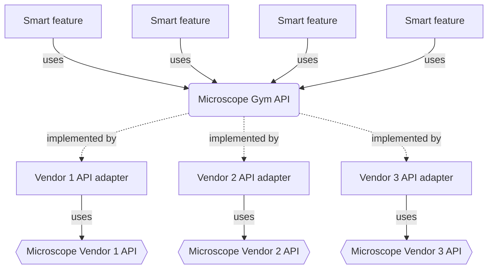

# Microscope Gym

## Example microscope APIs:

[pycromanager (python API for micromanager)](https://github.com/micro-manager/pycro-manager) possible template for which kind methods to implement
[openUC2 REST API](https://github.com/openUC2/UC2-REST)
[Natari](https://github.com/haesleinhuepf/natari)

python microscope (bad example)

## Code structure



### microscope GYM API

defines interfaces by inheriting from abc.abc
for example:

```python
from abc import ABC

class Stage(ABC):
    @property
    @abstractmethod
    def x_position(self):

    @abstractmethod
    move_x_to(target_x_position: float):

    @abstractmethod
    move_x_by(relative_x_position: float):
```

Versioned interface

as few setter methods as possible

## People that might be interested to get involved

* Marcus Jahnel
* Hugo (Jahnel lab)
* Honki Moon (Java smart microscope software)
* Benedict Diederich (from UC2 microscope)

## Next steps:

* [x] Schedule Meeting with Marcus and Hugo
* [x] Create GitHub repository
* [ ] order open uc2 microscope
* [ ] write microscope emulator

