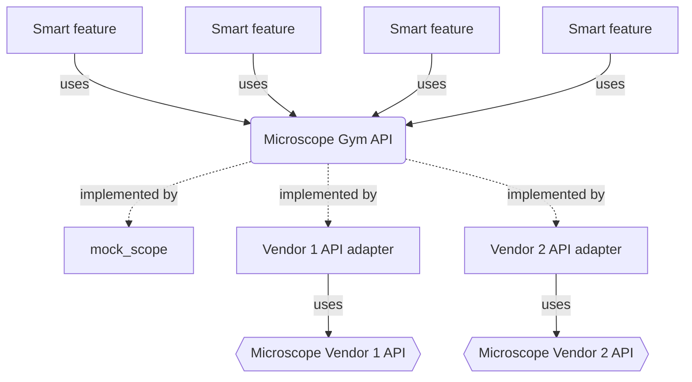

# Microscope Gym

## Installation

create a conda environment and install this repository

```bash
conda create -n microscope-gym-api python=3.9
conda activate microscope-gym-api
pip install git+https://gitlab.mn.tu-dresden.de/bia-pol/microscope-gym.git
```

if you want to run the notebooks from the documentation, it is recommended to install devbio-napari into the same environment:

```bash
conda install mamba
mamba install devbio-napari
```

## Code structure



### microscope GYM API

defines interfaces by inheriting from abc.abc
for example:

```python
from abc import ABC

class Stage(ABC):
    @property
    @abstractmethod
    def x_position(self):

    @abstractmethod
    move_x_to(target_x_position: float):

    @abstractmethod
    move_x_by(relative_x_position: float):
```

Versioned interface

as few setter methods as possible

## People that are involved

* Jamie White
* Hugo Sebastiao
* Marcus Jahnel
* Robert Haase
* Bert Nitzsche

## People that might be interested to get involved

* Honki Moon (Java smart microscope software)
* Benedict Diederich (from UC2 microscope)

## Next steps

* [x] Schedule Meeting with Marcus and Hugo
* [x] Create GitHub repository
* [x] order open uc2 microscope
* [x] write microscope emulator
* [x] write notebook explaining basic imaging api
* [x] write a notebook that uses napari to train an apoc model to identify microtubule crossings in the sample data
* [x] write smart feature that uses a trained apoc model generated in napari to find and imag certain features with the mock scope and then images a z-stack at the identified positions
* [ ] create napari plugin that implements the above feature in napari

## Example microscope APIs

[pycromanager (python API for micromanager)](https://github.com/micro-manager/pycro-manager) possible template for which kind methods to implement
[openUC2 REST API](https://github.com/openUC2/UC2-REST)
[Natari](https://github.com/haesleinhuepf/natari)

python microscope (bad example)
